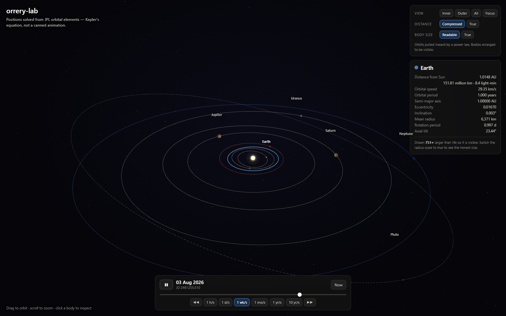
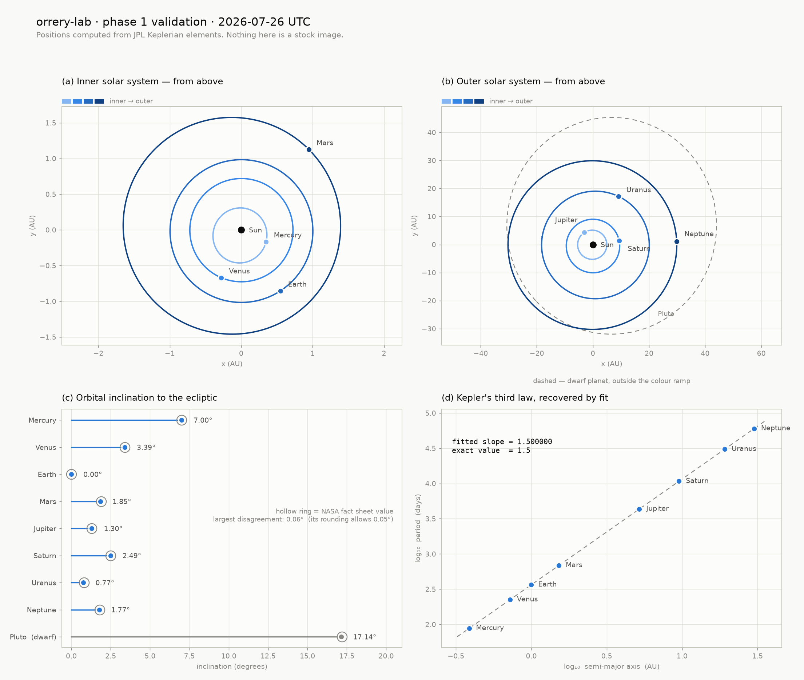
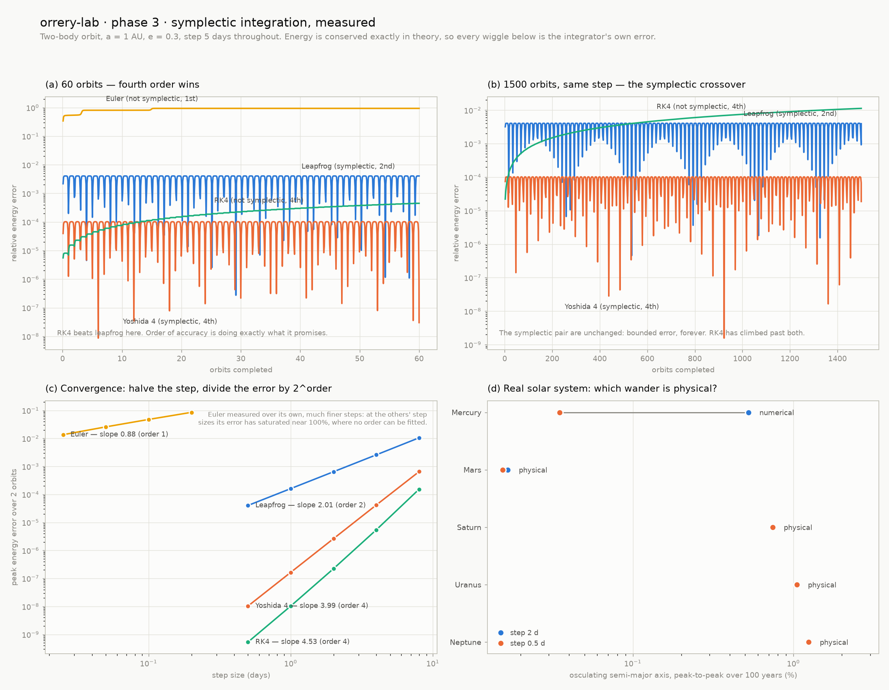
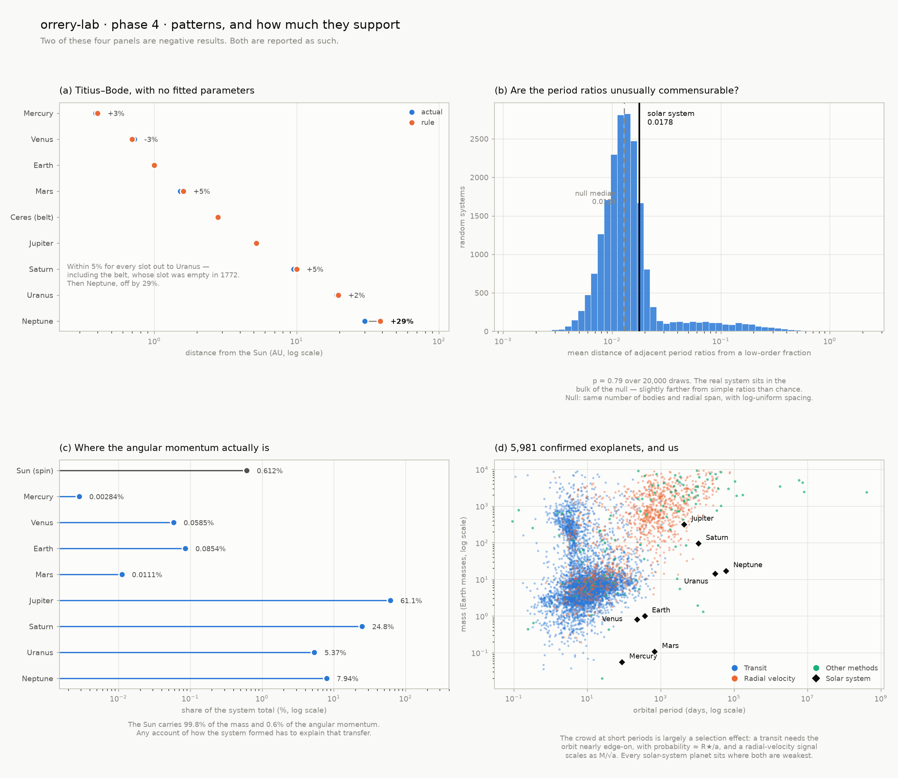
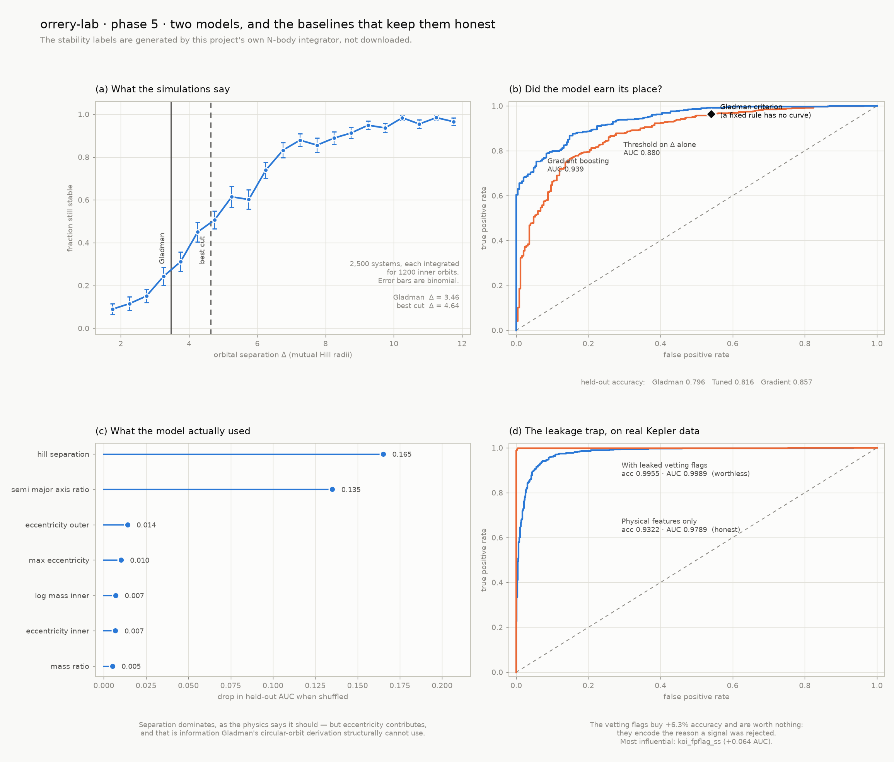
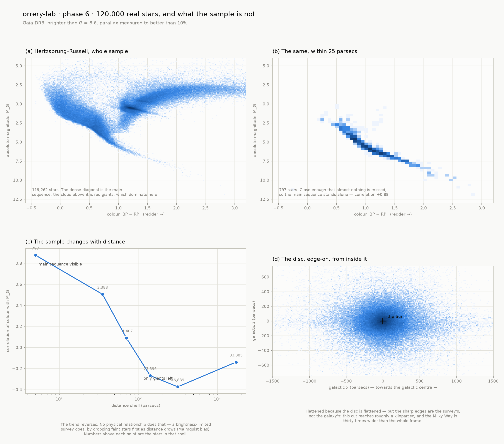

# orrery-lab

**An interactive 3D model of the solar system, built on real celestial mechanics — and a laboratory for doing statistics and machine learning on the sky.**

### ▶ [Open the live orrery](https://danielramon10.github.io/orrery-lab/)

*Português: [README.pt-BR.md](README.pt-BR.md)*

An *orrery* is a mechanical model of the solar system, the kind with brass arms and
hand-cranked gears. This is the computational equivalent. Every planet position
here is solved from published orbital elements — Kepler's equation, Newton-Raphson,
three rotation matrices — so the visualisation, the statistics and the models all
rest on physics rather than on decoration.

<p align="center">
  
</p>

<p align="center"><em>The browser scene. Scrub through three centuries, switch between honest and readable scale, click any body for live numbers.</em></p>

---

## Why this repository is not another matplotlib notebook

<p align="center">
  <picture>
    <source media="(prefers-color-scheme: dark)" srcset="docs/images/phase1-orbits-dark.png">
    
  </picture>
</p>

Panel (d) above is the point. The orbital periods are never told what Kepler's
third law is — they come out of `P = 2π√(a³/GM)` for each planet independently.
Fitting a line through `log a` against `log P` returns a slope of

```
1.500000000000   (exact value 3/2, absolute error 2.2e-16)
```

That is machine precision. If the Kepler solver, the unit system, or the element
table were wrong anywhere, this number would not land there.

---

## Status

| Phase | What it delivers | State |
|-------|------------------|-------|
| **1. Celestial mechanics core** | Kepler solver, orbital elements of all 8 planets, 3D state vectors, frame rotations, 155 tests | ✅ **done** |
| **2. 3D orrery in the browser** | React + Three.js scene, real orbits, time scrubber, honest/readable scale modes, 104 tests including Python↔TypeScript parity | ✅ **done** |
| **3. N-body simulation** | Four integrators, measured convergence orders, the symplectic crossover, and a diagnostic separating real perturbation from numerical error | ✅ **done** |
| **4. Statistics layer** | Regression with real error bars, Titius–Bode as a parameter-free prediction, resonance search, a Monte Carlo hypothesis test, and 5,981 exoplanets for context | ✅ **done** |
| **5. Machine learning** | Stability predictor trained on 2,500 systems this project simulated itself, benchmarked against the analytic Hill criterion; plus a worked target-leakage failure on real Kepler data | ✅ **done** |
| **6. The Milky Way** | 120,000 Gaia DR3 stars: the HR diagram, the galactic disc in 3D, Malmquist bias measured — and the real sky inside the browser scene | ✅ **done** |
| 7. Portfolio polish | Notebooks, CI, live demo, documentation | planned |

---

## Quick start

```bash
git clone https://github.com/<your-user>/orrery-lab.git
cd orrery-lab

python -m venv .venv
.venv\Scripts\activate          # Windows
# source .venv/bin/activate     # macOS / Linux

pip install -e ".[viz,dev]"
```

Where is everything right now?

```bash
python scripts/solar_system_report.py
```

```
Solar system state  |  2026-07-26 00:00 UTC  |  JD 2461247.50000
========================================================================================================
Body         r (AU)  r (10^6 km)     speed      lon     lat    a (AU)       e    incl        period
                                      km/s      deg     deg                       deg         years
--------------------------------------------------------------------------------------------------------
Mercury      0.3886        58.14     47.68   334.66   -6.72    0.3871  0.2056    7.00         0.241
Venus        0.7254       108.52     34.92   247.37    0.55    0.7233  0.0068    3.39         0.615
Earth        1.0157       151.95     29.32   302.69    0.00    1.0000  0.0167   -0.00         1.000
Mars         1.4720       220.21     24.96    49.94    0.01    1.5237  0.0934    1.85         1.881
Jupiter      5.2822       790.21     12.86   125.78    0.56    5.2029  0.0484    1.30        11.868
Saturn       9.4547      1414.40      9.73     8.59   -2.40    9.5367  0.0539    2.49        29.451
Uranus      19.4476      2909.32      6.71    61.89   -0.16   19.1892  0.0473    0.77        84.061
Neptune     29.8786      4469.78      5.47     2.23   -1.37   30.0699  0.0086    1.77       164.895
```

Regenerate the figure, and run the suite:

```bash
python scripts/plot_orbits.py
pytest
```

Reproduce the integrator study:

```bash
python scripts/plot_energy_drift.py           # ~20 s
python scripts/plot_energy_drift.py --quick   # shorter spans
```

Reproduce the statistics:

```bash
python scripts/fetch_exoplanets.py --koi   # one network call, cached afterwards
python scripts/plot_statistics.py
```

Train the models (simulates 2,500 systems, ~2.5 min):

```bash
python scripts/train_models.py
python scripts/train_models.py --quick
```

Bring in the stars:

```bash
python scripts/fetch_gaia.py          # 120,000 Gaia DR3 sources
python scripts/plot_milky_way.py
python scripts/export_star_data.py    # feeds the real sky into the 3D scene
```

Run the 3D scene:

```bash
cd web
npm install
npm run dev        # http://localhost:5173/orrery-lab/
npm run test       # includes parity against the Python reference
```

Use it as a library:

```python
from orrery import body_state, julian_date

mars = body_state("mars", julian_date(2026, 12, 25))

mars.position        # array([x, y, z]) in AU, heliocentric ecliptic J2000
mars.velocity        # array([vx, vy, vz]) in AU/day
mars.distance_au     # 1.4368...
mars.speed_km_per_s  # 25.3...
```

---

## The physics, in four steps

Given a date, where is a planet? The answer is never a lookup — it is solved.

**1 · Propagate the elements.** Six numbers describe an orbit: its size `a`,
its squashedness `e`, its tilt `i`, and three angles fixing its orientation and
the planet's position along it. Because the planets tug on each other, even the
"fixed" ones drift, so `orrery/elements.py` stores each element *and its rate of
change per century*, from JPL's approximate-elements table.

**2 · Solve Kepler's equation.** Time enters through the mean anomaly `M`, which
grows perfectly linearly. But the planet does not move at a constant rate — it
races through perihelion and crawls through aphelion. The bridge is

$$M = E - e\sin E$$

which has no closed-form solution for `E`. `orrery/kepler.py` solves it by
Newton-Raphson, with a bracketed bisection fallback for the very eccentric case:
rearranging gives `E = M + e sin E`, so the root is always trapped inside
`[M − e, M + e]`.

**3 · Place the planet on its flat ellipse.**

$$x' = a(\cos E - e), \qquad y' = a\sqrt{1-e^2}\,\sin E$$

**4 · Rotate that ellipse into 3D.** Three rotations, `R = R_z(Ω) · R_x(i) · R_z(ω)`:
spin the ellipse in its own plane, tip the plane by the inclination, then swing it
round to its ascending node. The same matrix rotates velocity as well as position,
so differentiating steps 3 gives full state vectors — which is exactly what the
N-body integrator in phase 3 will need as initial conditions.

---

## How phase 1 is validated

155 tests, and deliberately not one of them is "compare against a saved array".
Three independent kinds of check:

**Physical laws** — the strongest kind, because a plausible-but-wrong answer
cannot satisfy them:

- Kepler's equation residual `|E − e sin E − M| < 1e-11` across eccentricities from 0 to 0.99
- Angular momentum `h = r × v` constant in *direction and magnitude* around every orbit (Kepler's second law), and matching the closed form `√(GM·a(1−e²))`
- Orbital energy constant and negative; the vis-viva equation `v² = GM(2/r − 1/a)`
- Kepler's third law: the fitted `log a` → `log P` slope is exactly 3/2

**Round-tripping** — recover `a`, `e` and `i` back out of the computed state
vector with textbook inverse formulas. This catches rotation-matrix errors that
conservation laws are blind to.

**Published values** — numbers that do not come from this codebase:

| Check | Computed | Published |
|---|---|---|
| Earth–Sun distance at J2000 | 0.9833 AU | 0.9833 AU |
| Sun's ecliptic longitude at J2000 | 280.4° | 280.4° |
| Earth's perihelion | 2–4 January | 2–5 January |
| Earth's aphelion | ~4 July | ~4 July |
| Orbital periods, all 8 planets | within 0.5% | sidereal periods |
| Orbital speeds, all 8 planets | within range | perihelion/aphelion ranges |
| Inclinations, all 8 planets + Pluto | within 0.06° | NASA fact sheet (rounded to 0.1°) |

---

## Phase 2 — the browser scene, and its two hard problems

### The same physics twice, without letting the copies drift

The scene has to place nine bodies on every animation frame, for any date you scrub
to. Precomputed positions would mean either a huge payload or a scene locked to a
fixed date range, so the browser gets **its own port of the Kepler solver**.

Two implementations of the same equations is a genuine hazard: they can drift apart
silently, and the scene would look perfectly plausible while being wrong. Two
measures keep that honest:

1. **The element table is generated, never copied.**
   `scripts/export_web_data.py` writes `web/src/data/elements.generated.ts` from
   `orrery/elements.py`, so there is one source of truth for the numbers. CI fails
   if the committed file is stale.
2. **A parity fixture pins the port to Python.** The same script records what Python
   computes for 9 bodies × 8 dates spanning 1800–2100, and
   `web/src/lib/ephemeris.test.ts` replays all 72 states through the TypeScript
   code. Agreement is required to **1×10⁻¹² relative** — about four centimetres at
   Neptune's distance.

The tolerance is relative rather than absolute on purpose: numpy's `sin` and V8's
`Math.sin` are not bit-identical, and the discrepancy scales with the size of the
coordinate. An absolute bound would be slack for Mercury at 0.39 AU and unmeetable
for Neptune at 30 AU.

### Scale: the lie every solar-system diagram tells

Earth's radius is 4.3×10⁻⁵ AU. Neptune orbits at 30 AU. A true-scale render that
fits Neptune on screen makes every planet smaller than one pixel. Every
solar-system illustration you have seen distorts this, usually silently.

This one puts both distortions in the UI as switches, and always reports the factor:

| Mode | What it does |
|---|---|
| Distance · **Compressed** | Power law pulls the outer planets in, so the inner four are not a knot at the centre. Ordering and direction survive; ratios do not. |
| Distance · **True** | Exactly proportional. |
| Size · **Readable** | Power law keeps bodies ordered and comparable while making them visible. The read-out states the exaggeration — Earth is drawn about 750× too large. |
| Size · **True** | Physically exact. Worth switching to once: it is the only honest way to feel how empty the solar system is. |

---

## Phase 3 — N-body, and why the integrator matters more than its accuracy order

Phase 1 solved the *two-body* problem exactly. Reality has nine bodies pulling on
each other, and that has no closed-form solution — it has to be stepped forward.
Which stepper you choose turns out to matter more than its advertised accuracy.

<p align="center">
  <picture>
    <source media="(prefers-color-scheme: dark)" srcset="docs/images/phase3-integrators-dark.png">
    
  </picture>
</p>

### The measurement

Same two-body orbit, same 5-day step, only the duration changes:

| Integrator | 60 orbits | 1500 orbits | Growth |
|---|---|---|---|
| Leapfrog (symplectic, 2nd order) | 4.056×10⁻³ | **4.056×10⁻³** | none — identical to every digit |
| Yoshida 4 (symplectic, 4th order) | 1.017×10⁻⁴ | **1.017×10⁻⁴** | none |
| RK4 (not symplectic, 4th order) | 4.481×10⁻⁴ | **1.128×10⁻²** | 25× |

RK4 starts out **nine times better** than leapfrog and ends up **2.8 times worse**.
That is the whole argument. A symplectic method exactly conserves a slightly-wrong
energy, so its error oscillates inside a fixed band forever; RK4 conserves nothing
exactly, so its error accumulates in one direction without limit.

Note what this does *not* claim. Over a few dozen orbits RK4 is genuinely the better
choice, and the test suite asserts as much so the README cannot quietly drift into
overclaiming. The useful statement is narrower: leapfrog's error never grows, so some
integration length always exists past which it wins.

Panel (c) confirms each scheme is what it says: fitted log-log slopes of **2.01**,
**3.99** and **4.53** against claimed orders 2, 4 and 4. Euler is measured over its
own much finer steps, because at the others' step sizes its error has already
saturated near 100% — and you cannot fit a convergence order to a curve that has hit
its ceiling.

### A diagnostic worth stealing

Integrating the real solar system, the outer planets' orbital elements wander by
around 1% over a century. That looks like the integrator failing. It is not — and the
way to tell is to **change the step size**:

| Body | step 2 d | step 0.5 d | Verdict |
|---|---|---|---|
| Mercury | 0.5235% | 0.0351% | **numerical** — shrinks as dt², so it is discretisation |
| Mars | 0.0166% | 0.0155% | physical |
| Saturn | 0.7423% | 0.7421% | **physical** — step-independent |
| Uranus | 1.0493% | 1.0485% | physical |
| Neptune | 1.2442% | 1.2418% | physical |

Real physics does not care what step size you chose. Neptune's 1.24% is the mutual
gravity of the giant planets — exactly the perturbation the two-body ephemeris of
phase 1 cannot represent, and the reason this phase exists. Mercury's 0.52% is
entirely an artefact of resolving an 88-day orbit with a 2-day step, and it is the
*larger* of the two at that step size, which is precisely how a fixed tolerance would
have led you to the wrong conclusion.

### Also verified

- **Newton's third law**: `Σ GM_i·a_i = 0` to 10⁻²⁰, which is why the barycentre cannot accelerate
- **Exact time-reversibility** of leapfrog: integrate 500 days forward then back and return to the start to 10⁻¹¹ AU. RK4 does not close the loop — asserted, so the contrast is measured
- **Momentum** conserved to round-off by every scheme; **angular momentum** to 10⁻¹³ by the symplectic pair, 10⁻⁸ by RK4, and *not at all* by Euler
- The heliocentric→barycentric shift, checked by confirming the Sun sits ~0.005 AU off the origin — displaced by Jupiter, roughly one solar radius

---

## Phase 4 — patterns, and how much they actually support

The hardest thing about this phase was not computing the statistics. It was being
honest about them: two of the four results below are **negative**, and the temptation
to quietly present a pattern as stronger than the data allow is exactly what makes
most popular writing about the solar system misleading.

<p align="center">
  <picture>
    <source media="(prefers-color-scheme: dark)" srcset="docs/images/phase4-statistics-dark.png">
    
  </picture>
</p>

### Titius–Bode: a striking pattern with no known cause

Evaluated as a **parameter-free prediction**. The constants 0.4 and 0.3 were written
down in the 1770s and are not adjusted here, so this is genuinely out-of-sample:

| Body | Actual | Rule | Error |
|---|---|---|---|
| Mercury | 0.387 AU | 0.400 | +3.3% |
| Venus | 0.723 | 0.700 | −3.2% |
| Earth | 1.000 | 1.000 | 0.0% |
| Mars | 1.524 | 1.600 | +5.0% |
| **Ceres** (asteroid belt) | 2.766 | 2.800 | **+1.2%** |
| Jupiter | 5.203 | 5.200 | −0.1% |
| Saturn | 9.537 | 10.000 | +4.9% |
| Uranus | 19.189 | 19.600 | +2.1% |
| **Neptune** | 30.070 | 38.800 | **+29.0%** |

Two things stand out. The belt's slot was **empty** when the rule was published, and
Ceres turned up there in 1801 — a real prediction, not a retrofit. And Neptune breaks
it badly. Pluto, at 39.5 AU, sits within **1.7%** of the slot Neptune failed to fill.

**And a statistical trap worth knowing.** Fitting a free geometric progression instead
scores **R² = 0.993** — which looks better — while making predictions off by up to
**20.7%**. When the response climbs monotonically across two orders of magnitude,
almost any increasing curve explains nearly all the variance, so R² is close to
uninformative. The test suite asserts *both* numbers together, so the flattering one
can never be quoted alone.

### Resonances: found by bounding both integers

| Pair | Ratio | Nearest | Off by | Order |
|---|---|---|---|---|
| Venus–Earth | 1.6255 | **13:8** | 0.03% | 5 |
| Neptune–Pluto | 1.5045 | **3:2** | 0.30% | 1 |
| Jupiter–Saturn | 2.4816 | **5:2** | 0.74% | 3 |
| Uranus–Neptune | 1.9616 | **2:1** | 1.92% | 1 |

Getting here required fixing a mistake. The obvious approach — Python's
`Fraction.limit_denominator` — bounds only the *denominator*, and with the numerator
free every ratio looks resonant: Pluto's period is 131.9 times Mars's, which `1319/10`
matches to five decimals while implying a **1309th-order** resonance. That is not a
resonance. Bounding both integers, and filtering on order, leaves exactly the
commensurabilities the literature discusses and nothing else.

### And they are not statistically remarkable

A Monte Carlo test against an explicit matched null — same number of bodies, same
radial span, log-uniform spacing — gives:

```
observed statistic  0.0178
null median         0.0129
p = 0.79  over 20,000 draws
```

The real solar system's adjacent period ratios are **slightly farther** from low-order
fractions than a random system typically is. Panel (b) shows the whole null
distribution rather than just the p-value, because the distribution is the result. The
p-value also depends on how the null is built, which is why the null is stated in the
docstring, in the figure, and here.

### Angular momentum: the fact that needs explaining

| Component | Share |
|---|---|
| Jupiter | **61.1%** |
| Saturn | 24.8% |
| Neptune | 7.9% |
| Uranus | 5.4% |
| Sun (spin) | **0.61%** |
| Earth | 0.085% |

The Sun holds 99.8% of the mass and under one percent of the angular momentum. Any
account of how the system formed has to explain that transfer.

### 5,981 exoplanets, and the selection effects that shape them

Every statistic above comes from a sample of **one**. The NASA Exoplanet Archive
supplies the rest, and panel (d) puts the solar system on top of it — where it sits
almost entirely *outside* the observed cloud.

That is mostly about our instruments, not the galaxy. A transit needs the orbit nearly
edge-on, with probability ≈ R★/a, so a three-day planet is roughly twenty times easier
to catch than one at Earth's distance; radial velocity favours massive and close.
`orrery/exoplanets.py` states both biases up front and keeps the discovery method
attached to every planet so it can be conditioned on.

---

## Phase 5 — two models, and the baselines that keep them honest

<p align="center">
  <picture>
    <source media="(prefers-color-scheme: dark)" srcset="docs/images/phase5-models-dark.png">
    
  </picture>
</p>

### The dataset is generated, not downloaded

The stability model's labels come from **simulating every system**. 2,500 two-planet
configurations are drawn at random, each integrated for 1,200 orbits with the same
gravity built in phase 3, and labelled by what actually happened — semi-major axis
change beyond 20%, a close encounter inside one Hill radius, or an escape.

That means the entire chain is auditable: if the labels are wrong, the physics is
wrong, and the physics has 44 tests on it.

Doing that at scale needed a **batched integrator** — the phase 3 one steps a single
system at a time, which is right for the solar system and hopeless for 2,500 of them.
The batched version carries a leading axis and steps everything at once. A fast
reimplementation of existing physics is only safe if something pins it to the original,
so `tests/test_stability.py` asserts the two agree to 1e-11 over 400 steps — the same
guard the Python↔TypeScript ephemeris parity provides in phase 2.

### Did the model earn its place?

There is already an analytic answer here: **Gladman's criterion**, Δ > 2√3 ≈ 3.46,
where Δ is the orbital separation in mutual Hill radii. So three approaches are
measured side by side on the same held-out split:

| Approach | Accuracy | ROC AUC |
|---|---|---|
| Gladman criterion (Δ > 3.46, as published) | 0.796 | — |
| **Tuned threshold** (Δ > 4.64, fitted on train) | 0.816 | 0.880 |
| Gradient boosting (9 features) | **0.857** | **0.939** |

The middle row is the one most write-ups leave out, and it is the one that matters.
Beating a fixed textbook threshold proves little when simply *moving* that threshold
buys two points. The claim worth making is that the model beats **the best possible
single cut on the same feature** by 4.1 points — and 5-fold cross-validation puts the
AUC at 0.941 ± 0.007.

Why it can: permutation importance shows separation dominating, as the physics says it
must, but eccentricity contributing measurably — and eccentricity is exactly what
Gladman's circular-orbit derivation structurally cannot use. The fitted threshold
landing at Δ = 4.64 rather than 3.46 says the same thing in one number.

### The leakage trap, on real Kepler data

The KOI table has 2,747 confirmed planets and 4,839 false positives — and five columns
that look like excellent features and are in fact the *output of the labelling
process*: `koi_score` and four `koi_fpflag_*` columns recording **why** a signal was
rejected.

| Features | Accuracy | ROC AUC |
|---|---|---|
| Physical only — light curve + host star | 0.9322 | 0.9789 |
| With the vetting flags | **0.9955** | **0.9989** |

The second row is the worthless one. Those 6.3 points are the model learning to read
the answer key, and `koi_fpflag_ss` ("stellar eclipse") alone accounts for most of it.
`orrery/koi.py` partitions the columns explicitly so the trap cannot be walked into by
accident, and `tests/test_models.py` asserts the gap exists — a demonstration only
works if the trap is really a trap.

### Stated limits

Two planets, coplanar, point-mass star, no tides or relativity. The label means
"survived 1,200 orbits", not "stable forever" — real systems destabilise on timescales
far longer than any window used here.

---

## Phase 6 — 120,000 real stars, and what the sample is not

<p align="center">
  <picture>
    <source media="(prefers-color-scheme: dark)" srcset="docs/images/phase6-milkyway-dark.png">
    
  </picture>
</p>

Everything before this lives inside the solar system, where distance is measured by
radar and the geometry is exact. Stepping outside means meeting the project's first
genuinely **uncertain** measurement — and resisting the urge to hide that behind a
one-line conversion.

### Parallax is not a distance

Gaia measures parallax; distance is `1/parallax`. That formula is where most casual
uses of this catalogue go wrong, in three separate ways:

- **Negative parallaxes are real.** For a distant star the true parallax is smaller
  than the noise, so noise pushes some measurements below zero. Inverting one gives a
  negative distance that then quietly poisons every plot downstream.
- **The reciprocal is biased** even when positive, badly so past ~20% fractional error.
- **A magnitude-limited sample is not a volume-limited one.**

`distance_from_parallax` does not solve these — they are not solvable with a formula.
It **returns `nan`** below a stated signal-to-noise, keeping the discarded stars
visible to the caller instead of silently absent.

### The bias, measured rather than described

The first version of the HR-diagram test asserted the main sequence — redder stars are
fainter — and **failed**, correlation −0.49 instead of positive. Not a bug. This sample
reaches only G = 8.6, so past a hundred parsecs nothing but giants is bright enough to
appear, and giants are red *and* luminous.

| Distance shell | Stars | corr(colour, M_G) | Faintest visible |
|---|---|---|---|
| 0–25 pc | 797 | **+0.875** | M = +11.9 |
| 25–50 pc | 3,388 | +0.504 | +6.6 |
| 50–100 pc | 11,407 | +0.090 | +5.1 |
| 100–200 pc | 23,696 | −0.268 | +3.6 |
| 200–500 pc | 46,889 | **−0.374** | +2.1 |

**No physical relationship reverses with distance.** A brightness-limited survey does,
by dropping faint stars first — Malmquist bias, visible in one table. The tests now
assert the main sequence *within 25 parsecs*, where the sample is nearly
volume-limited, and separately assert that the correlation flips.

### A rotation matrix that nearly got away

The ICRS→galactic transform is built from three angles rather than pasted in as nine
numbers. The first attempt was orthogonal, had determinant exactly 1, and put the north
galactic pole precisely at b = +90° — while placing the **galactic centre at l = 90°
instead of 0°**. A quarter-turn error that every internal check passed. Only comparison
against the published matrix caught it, and a test now pins all nine elements.

### The sky in the scene is now the real sky

`export_star_data.py` feeds 9,000 Gaia sources into the browser, replacing phase 2's
procedural stars. The constellations are the constellations. A **Stars** control
switches between the view from here and their true 3D positions in parsecs — pull the
camera back in that mode and the flattened disc appears, because it is in the data.

Building it turned up a quiet failure worth knowing: a per-vertex `size` attribute on
a three.js `PointsMaterial` **does nothing**. That material has one scalar size for the
whole cloud, so every star rendered identically and the sky came out flat. Brightness
now rides in the colour, which additive blending handles for free.

---

## Layout

```
orrery/                  the Python library
├── constants.py         physical constants, masses, radii, frames
├── timescales.py        calendar dates <-> Julian Dates
├── kepler.py            Kepler's equation, anomaly conversions
├── elements.py          orbital elements of the planets + secular drift
├── ephemeris.py         elements -> 3D state vectors, orbit sampling
├── nbody.py             four integrators + conservation diagnostics
├── initial_conditions.py  ephemeris -> barycentric starting states
├── statistics.py        regression with error bars, resonances, Monte Carlo
├── exoplanets.py        the NASA archive, with its selection effects documented
├── koi.py               labelled Kepler signals, with the leaky columns quarantined
├── stability.py         batched N-body that generates the stability labels
├── models.py            the two learning problems and their baselines
└── gaia.py              the star catalogue, and the honesty of parallax

scripts/
├── solar_system_report.py   the table view: where everything is, right now
├── plot_orbits.py           the phase 1 validation figure
├── plot_energy_drift.py     the phase 3 integrator study
├── plot_statistics.py       the phase 4 figure
├── train_models.py          the phase 5 models and figure
├── plot_milky_way.py        the phase 6 figure
├── fetch_gaia.py            downloads the Gaia sample
├── export_star_data.py      packs the real sky for the browser
├── fetch_exoplanets.py      the only script that touches the network
├── check_generated_data.py  CI's staleness check, compared numerically
└── export_web_data.py       generates the scene's element table + parity fixture

web/src/
├── data/*.generated.*   produced by export_web_data.py — never edit by hand
├── lib/kepler.ts        port of orrery/kepler.py
├── lib/ephemeris.ts     port of orrery/ephemeris.py
├── lib/ephemeris.test.ts  104 tests, incl. 72 parity cases against Python
├── lib/scale.ts         the distance/radius scale modes
├── scene/               Sun, planets, orbit lines, camera framing
├── state/               the clock (a mutable ref, not React state — see comments)
└── ui/                  time controls, scale toggles, live read-out

tests/                   331 Python tests: conservation laws, round-trips, real values
data/cache/              exoplanet snapshot (gitignored, reproducible)
docs/images/             generated figures and the scene screenshot
.github/workflows/       CI (both languages + staleness check) and Pages deploy
```

**435 tests in total** — 331 Python, 104 TypeScript. Everything runs offline except
`fetch_exoplanets.py`.

---

## Data sources

- **Orbital elements** — [JPL, Keplerian Elements for Approximate Positions of the Major Planets](https://ssd.jpl.nasa.gov/planets/approx_pos.html) (E. M. Standish). Linear-rate form, accurate to about an arcminute over 1800–2050.
- **Constants and masses** — IAU 2015 nominal values; DE440 mass ratios.
- **Cross-check values** — [NASA Planetary Fact Sheet](https://nssdc.gsfc.nasa.gov/planetary/factsheet/).
- **Phase 6** — [Gaia DR3](https://www.cosmos.esa.int/web/gaia/dr3) (ESA).

## Accuracy, honestly

The approximate-element method is right for an interactive scene: about an
arcminute of angular error over 1800–2050, at a cost cheap enough to run every
animation frame. It is *not* a substitute for a full JPL ephemeris (DE440) and
should not be used for spacecraft navigation or occultation timing. Earth's entry
is really the Earth–Moon barycentre, which is what the source table tabulates.

## Licence

MIT — see [LICENSE](LICENSE).
