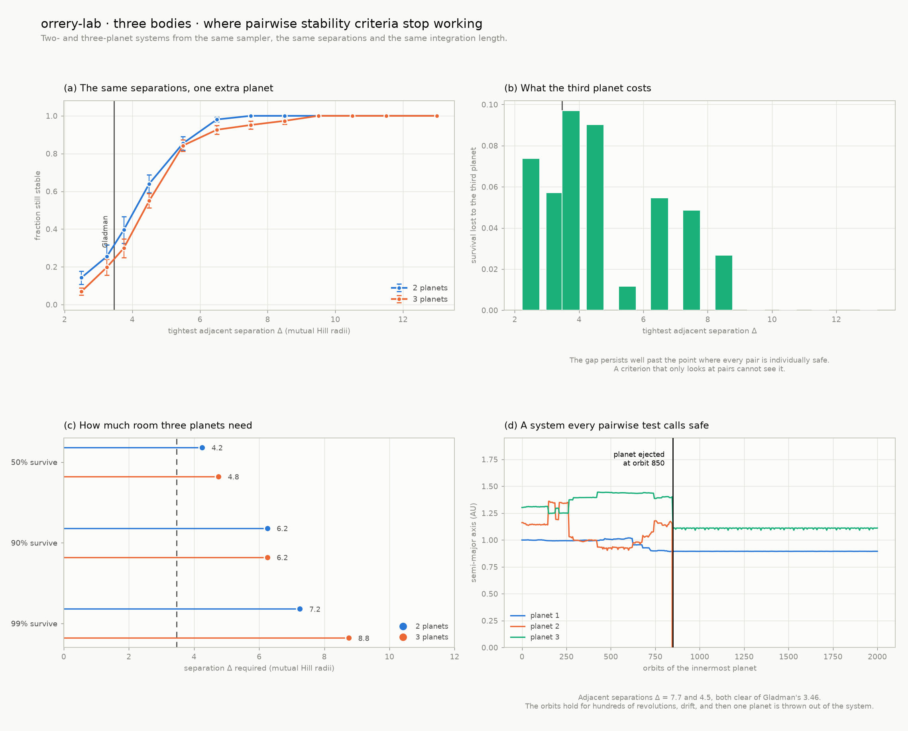

# orrery-lab

**Uma maquete 3D interativa do Sistema Solar construída sobre mecânica celeste real — e um laboratório para fazer estatística e machine learning sobre o céu.**

### ▶ [Abrir a maquete ao vivo](https://danielramon10.github.io/orrery-lab/)

*English: [README.md](README.md)*

Um *orrery* é aquela maquete mecânica do Sistema Solar, com braços de latão e
manivela. Este projeto é o equivalente computacional. Toda posição de planeta aqui
é **resolvida** a partir de elementos orbitais publicados — equação de Kepler,
Newton-Raphson, três matrizes de rotação — para que a visualização, a estatística
e os modelos se apoiem em física, e não em enfeite.

<p align="center">
  
</p>

<p align="center"><em>A cena no navegador. Percorra três séculos, alterne entre escala honesta e legível, clique em qualquer corpo para ver os números ao vivo.</em></p>

---

## Por que este repositório não é mais um notebook de matplotlib

<p align="center">
  <picture>
    <source media="(prefers-color-scheme: dark)" srcset="docs/images/phase1-orbits-dark.png">
    
  </picture>
</p>

O painel (d) acima é o ponto central. Em nenhum lugar do código se informa aos
períodos orbitais qual é a terceira lei de Kepler — cada um sai de
`P = 2π√(a³/GM)` independentemente. Ajustar uma reta em `log a` contra `log P`
devolve uma inclinação de

```
1,500000000000   (valor exato 3/2, erro absoluto 2,2e-16)
```

Isso é precisão de máquina. Se o solver de Kepler, o sistema de unidades ou a
tabela de elementos estivessem errados em qualquer ponto, esse número não cairia ali.

---

## Situação

| Fase | O que entrega | Estado |
|------|---------------|--------|
| **1. Núcleo de mecânica celeste** | Solver de Kepler, elementos orbitais dos 8 planetas, vetores de estado 3D, rotação de referenciais, 155 testes | ✅ **pronta** |
| **2. Maquete 3D no navegador** | Cena React + Three.js, órbitas reais, controle de tempo, modos de escala honesta/legível, 104 testes incluindo paridade Python↔TypeScript | ✅ **pronta** |
| **3. Simulação N-corpos** | Quatro integradores, ordens de convergência medidas, o crossover simplético, e um diagnóstico que separa perturbação real de erro numérico | ✅ **pronta** |
| **4. Camada estatística** | Regressão com barras de erro reais, Titius–Bode como predição sem parâmetros, busca de ressonâncias, teste de hipótese por Monte Carlo, e 5.981 exoplanetas para contexto | ✅ **pronta** |
| **5. Machine learning** | Preditor de estabilidade treinado em 2.500 sistemas que o próprio projeto simulou, comparado contra o critério analítico de Hill; mais uma falha de vazamento de alvo demonstrada em dados reais do Kepler | ✅ **pronta** |
| **6. Via Láctea** | 120.000 estrelas do Gaia DR3: diagrama HR, o disco galáctico em 3D, viés de Malmquist medido — e o céu real dentro da cena no navegador | ✅ **pronta** |
| **7. Polimento de portfólio** | Documentação reestruturada, catálogo dos próprios erros do projeto, verificação em clone limpo | ✅ **pronta** |

---

## O que este projeto encontrou

Cada item liga para a seção que mostra a conta.

| | |
|---|---|
| **Terceira lei de Kepler com precisão de máquina.** Ajustar `log a` contra `log P` devolve inclinação 1,500000000000 — erro 2,2×10⁻¹⁶. O expoente nunca é informado. | [↓](#por-que-este-reposit%C3%B3rio-n%C3%A3o-%C3%A9-mais-um-notebook-de-matplotlib) |
| **O crossover simplético, medido.** Em 1.500 órbitas com passo fixo, o pico de erro de energia do leapfrog é *idêntico até o último dígito* ao valor em 60 órbitas, enquanto o do RK4 cresce 25×. O RK4 começa 9× melhor e termina 2,8× pior. | [↓](#fase-3--n-corpos-e-por-que-o-integrador-importa-mais-que-sua-ordem-de-precis%C3%A3o) |
| **Distinguir física real de erro numérico.** Os elementos de Netuno vagam 1,2% por século e os de Mercúrio 0,5%. Divida o passo pela metade: o de Netuno não muda (perturbação real), o de Mercúrio cai 15× (discretização). O artefato era o *maior* dos dois. | [↓](#um-diagn%C3%B3stico-que-vale-roubar) |
| **Titius–Bode como predição sem parâmetros.** Dentro de 5% em todos os slots até Urano — incluindo o cinturão de asteroides, cujo slot estava vazio quando a regra foi escrita — e então 29% errado em Netuno. Plutão fica a 1,7% do slot que Netuno não ocupou. | [↓](#titiusbode-um-padr%C3%A3o-marcante-sem-causa-conhecida) |
| **Um resultado negativo, reportado como tal.** As razões de período do Sistema Solar **não** são especialmente próximas de frações simples: p = 0,79 contra uma nula pareada, e ligeiramente mais longe de comensurável que o azar. | [↓](#e-elas-n%C3%A3o-s%C3%A3o-estatisticamente-not%C3%A1veis) |
| **Um modelo que ganha o lugar dele.** Prever estabilidade orbital a partir de 2.500 sistemas que o projeto simulou: 0,857 de acurácia contra 0,816 do *melhor limiar possível* na mesma feature, e 0,796 do critério analítico de livro-texto. | [↓](#o-modelo-ganhou-o-lugar-dele) |
| **Vazamento de alvo, demonstrado.** O mesmo classificador do Kepler marca 0,932 com features físicas e 0,996 quando recebe as flags de vetting — que codificam a resposta. O segundo número é o inútil. | [↓](#a-armadilha-de-vazamento-em-dados-reais-do-kepler) |
| **Viés de Malmquist numa tabela.** A correlação cor–brilho de 120.000 estrelas do Gaia **inverte de sinal** com a distância, de +0,88 perto para −0,37 longe. Nenhuma relação física faz isso; um levantamento limitado por brilho faz. | [↓](#o-vi%C3%A9s-medido-em-vez-de-descrito) |

---

## Onde este projeto errou

Cada um destes foi um erro real, pego por algo dentro do repositório e não por inspeção.
Estão listados porque um projeto que mostra só os acertos está mostrando metade da
engenharia.

| O erro | Como apareceu |
|---|---|
| Implementei Titius–Bode como progressão geométrica ajustada. Não é — a regra real tem termo aditivo. Minha versão marcava R² = 0,993 errando Marte em 20%, e *melhorava* ao incluir Netuno, invertendo a história real. | Os erros por planeta, depois que a estatística agregada pareceu boa |
| Busquei ressonâncias com `Fraction.limit_denominator`, que limita só o denominador. Com numerador livre, "Plutão:Marte = 1319:10" casa com cinco decimais e implica ressonância de ordem 1309. | Ler a saída em vez de confiar nela |
| Afirmei que leapfrog vence RK4. Falso na escala que eu testava — a vantagem simplética é assintótica, não universal. | Um teste que escrevi para provar, e que falhou |
| Afirmei que todo integrador conserva momento angular. O Euler deriva 8%. | Parametrizar o teste sobre os quatro |
| Medi deriva orbital comparando a média de um arco curto com a de uma órbita inteira. Isso mede fase orbital, não deriva. | Uma "falha" de 1,6% que era a minha métrica, não a física |
| Documentei o erro de integração da estabilidade como ~10⁻⁶. Medido: 4×10⁻⁴, exatamente `(dt/P)²`. | Medir em vez de afirmar |
| Afirmei que o limiar ajustado sempre bate o analítico em dados de teste. Não bate, em amostras pequenas. | Uma rodada onde perdeu por 0,008 |
| Desenhei curvas ROC a partir de rótulos 0/1 em vez de probabilidades, achatando as duas em três pontos. | Olhar a figura renderizada |
| Construí a rotação ICRS→galáctica com erro de um quarto de volta. Ortogonal, determinante exatamente 1, polo precisamente em b = +90° — e o centro galáctico em l = 90° em vez de 0°. | Comparação com a matriz publicada; toda verificação interna passou |
| Defini um atributo `size` por vértice num `PointsMaterial` do three.js, que o ignora silenciosamente. Toda estrela renderizou igual. | Um screenshot, não o build |
| Escrevi um check de CI que regenerava dados e comparava bytes. A IEEE 754 não promete identidade bit a bit entre plataformas; falhou na primeira rodada limpa por um bit. | A primeira execução do CI, no primeiro push |

---

## Notebooks

Três notebooks contam as partes da história que os scripts não contam. Commitados **com
as saídas**, então o GitHub renderiza sem precisar rodar nada.

| | |
|---|---|
| [**1 · Onde está Marte hoje à noite?**](notebooks/01-solving-keplers-equation.ipynb) | De uma data a uma posição 3D, derivando cada passo. Newton–Raphson convergindo em três iterações mesmo com e = 0,95, e a anomalia verdadeira 35° à frente do movimento uniforme — a segunda lei de Kepler visível. |
| [**2 · Por que o integrador importa mais que sua precisão**](notebooks/02-why-integrators-matter.ipynb) | O crossover simplético localizado em **544 órbitas**, previsto pela taxa de crescimento do RK4 e depois confirmado. Ordens de convergência recuperadas dos dados; leapfrog fechando um ciclo ida-e-volta a 10⁻¹⁴ UA onde o RK4 fica em 10⁻⁷. |
| [**3 · O que os dados não dizem**](notebooks/03-what-the-data-does-not-say.ipynb) | Quatro formas de estar confiantemente errado, cada uma um erro realmente cometido aqui e reproduzido em vez de descrito. |

---
## Como começar

```bash
git clone https://github.com/<seu-usuario>/orrery-lab.git
cd orrery-lab

python -m venv .venv
.venv\Scripts\activate          # Windows
# source .venv/bin/activate     # macOS / Linux

pip install -e ".[viz,dev]"
```

Onde está tudo agora?

```bash
python scripts/solar_system_report.py
```

```
Solar system state  |  2026-07-26 00:00 UTC  |  JD 2461247.50000
========================================================================================================
Body         r (AU)  r (10^6 km)     speed      lon     lat    a (AU)       e    incl        period
                                      km/s      deg     deg                       deg         years
--------------------------------------------------------------------------------------------------------
Mercury      0.3886        58.14     47.68   334.66   -6.72    0.3871  0.2056    7.00         0.241
Venus        0.7254       108.52     34.92   247.37    0.55    0.7233  0.0068    3.39         0.615
Earth        1.0157       151.95     29.32   302.69    0.00    1.0000  0.0167   -0.00         1.000
Mars         1.4720       220.21     24.96    49.94    0.01    1.5237  0.0934    1.85         1.881
Jupiter      5.2822       790.21     12.86   125.78    0.56    5.2029  0.0484    1.30        11.868
Saturn       9.4547      1414.40      9.73     8.59   -2.40    9.5367  0.0539    2.49        29.451
Uranus      19.4476      2909.32      6.71    61.89   -0.16   19.1892  0.0473    0.77        84.061
Neptune     29.8786      4469.78      5.47     2.23   -1.37   30.0699  0.0086    1.77       164.895
```

Regerar a figura e rodar os testes:

```bash
python scripts/plot_orbits.py
pytest
```

Reproduzir o estudo de integradores:

```bash
python scripts/plot_energy_drift.py           # ~20 s
python scripts/plot_energy_drift.py --quick   # spans mais curtos
```

Reproduzir a estatística:

```bash
python scripts/fetch_exoplanets.py --koi   # uma chamada de rede, depois fica em cache
python scripts/plot_statistics.py
```

Treinar os modelos (simula 2.500 sistemas, ~2,5 min):

```bash
python scripts/train_models.py
python scripts/train_models.py --quick
```

Trazer as estrelas:

```bash
python scripts/fetch_gaia.py          # 120.000 fontes do Gaia DR3
python scripts/plot_milky_way.py
python scripts/export_star_data.py    # leva o céu real para a cena 3D
```

Rodar a cena 3D:

```bash
cd web
npm install
npm run dev        # http://localhost:5173/orrery-lab/
npm run test       # inclui a paridade contra a referência em Python
```

Usar como biblioteca:

```python
from orrery import body_state, julian_date

marte = body_state("mars", julian_date(2026, 12, 25))

marte.position        # array([x, y, z]) em UA, eclíptica heliocêntrica J2000
marte.velocity        # array([vx, vy, vz]) em UA/dia
marte.distance_au     # 1.4368...
marte.speed_km_per_s  # 25.3...
```

---

## A física, em quatro passos

Dada uma data, onde está o planeta? A resposta nunca é consulta a tabela — é cálculo.

**1 · Propagar os elementos.** Seis números descrevem uma órbita: o tamanho `a`,
o achatamento `e`, a inclinação `i`, e três ângulos que fixam sua orientação e a
posição do planeta ao longo dela. Como os planetas se atraem mutuamente, até os
elementos "fixos" derivam devagar — então `orrery/elements.py` guarda cada elemento
*e sua taxa de variação por século*, a partir da tabela de elementos aproximados do JPL.

**2 · Resolver a equação de Kepler.** O tempo entra pela anomalia média `M`, que
cresce perfeitamente linear. Mas o planeta **não** se move a taxa constante — ele
acelera no periélio e se arrasta no afélio. A ponte entre os dois é

$$M = E - e\sin E$$

que não tem solução fechada para `E`. O `orrery/kepler.py` resolve por
Newton-Raphson, com bisseção como rede de segurança para órbitas muito excêntricas:
reescrevendo como `E = M + e sin E`, a raiz está sempre presa dentro de
`[M − e, M + e]`.

**3 · Colocar o planeta na elipse plana.**

$$x' = a(\cos E - e), \qquad y' = a\sqrt{1-e^2}\,\sin E$$

**4 · Girar essa elipse para o 3D.** Três rotações, `R = R_z(Ω) · R_x(i) · R_z(ω)`:
gira a elipse no próprio plano, inclina o plano pela inclinação, e depois roda tudo
até o nó ascendente. A **mesma** matriz gira a velocidade além da posição, então
derivar o passo 3 no tempo já dá vetores de estado completos — exatamente o que o
integrador N-corpos da fase 3 vai precisar como condição inicial.

---

## Como a fase 1 foi validada

155 testes, e deliberadamente nenhum deles é "comparar com um array salvo".
Três tipos independentes de verificação:

**Leis físicas** — o tipo mais forte, porque uma resposta plausível-mas-errada não
consegue satisfazê-las:

- Resíduo da equação de Kepler `|E − e sin E − M| < 1e-11` para excentricidades de 0 a 0,99
- Momento angular `h = r × v` constante em *direção e módulo* ao longo de toda órbita (2ª lei de Kepler), coincidindo com a forma fechada `√(GM·a(1−e²))`
- Energia orbital constante e negativa; equação vis-viva `v² = GM(2/r − 1/a)`
- Terceira lei de Kepler: a inclinação ajustada de `log a` → `log P` é exatamente 3/2

**Ida e volta** — recuperar `a`, `e` e `i` de volta a partir do vetor de estado
calculado, usando as fórmulas inversas do livro-texto. Isso pega erros na matriz de
rotação que as leis de conservação não enxergam.

**Valores publicados** — números que não vêm deste código:

| Verificação | Calculado | Publicado |
|---|---|---|
| Distância Terra–Sol em J2000 | 0,9833 UA | 0,9833 UA |
| Longitude eclíptica do Sol em J2000 | 280,4° | 280,4° |
| Periélio da Terra | 2–4 de janeiro | 2–5 de janeiro |
| Afélio da Terra | ~4 de julho | ~4 de julho |
| Períodos orbitais, todos os 8 planetas | dentro de 0,5% | períodos siderais |
| Velocidades orbitais, todos os 8 | dentro da faixa | faixas periélio/afélio |
| Inclinações, 8 planetas + Plutão | dentro de 0,06° | NASA fact sheet (arredondada a 0,1°) |

---

## Fase 2 — a cena no navegador, e seus dois problemas difíceis

### A mesma física duas vezes, sem deixar as cópias divergirem

A cena precisa posicionar nove corpos a cada quadro de animação, para qualquer data
que você arraste. Posições pré-calculadas significariam ou um payload gigante ou uma
cena presa a um intervalo fixo de datas — então o navegador recebe **seu próprio port
do solver de Kepler**.

Duas implementações das mesmas equações é um risco real: elas podem divergir em
silêncio, e a cena pareceria perfeitamente plausível estando errada. Duas medidas
mantêm isso honesto:

1. **A tabela de elementos é gerada, nunca copiada.**
   O `scripts/export_web_data.py` escreve `web/src/data/elements.generated.ts` a
   partir de `orrery/elements.py`, então existe uma só fonte da verdade para os
   números. O CI falha se o arquivo commitado estiver desatualizado.
2. **Um fixture de paridade prende o port ao Python.** O mesmo script registra o que
   o Python calcula para 9 corpos × 8 datas cobrindo 1800–2100, e o
   `web/src/lib/ephemeris.test.ts` reproduz todos os 72 estados pelo código
   TypeScript. A concordância exigida é de **1×10⁻¹² relativo** — cerca de quatro
   centímetros na distância de Netuno.

A tolerância é relativa e não absoluta de propósito: o `sin` do numpy e o `Math.sin`
do V8 não são idênticos bit a bit, e a discrepância escala com o tamanho da
coordenada. Um limite absoluto seria frouxo para Mercúrio a 0,39 UA e impossível para
Netuno a 30 UA.

### Escala: a mentira que todo diagrama do Sistema Solar conta

O raio da Terra é 4,3×10⁻⁵ UA. Netuno orbita a 30 UA. Um render em escala real que
caiba Netuno na tela deixa todo planeta menor que um pixel. Toda ilustração de
Sistema Solar que você já viu distorce isso, normalmente em silêncio.

Esta coloca as duas distorções na interface como interruptores, e sempre informa o fator:

| Modo | O que faz |
|---|---|
| Distância · **Comprimida** | Lei de potência traz os planetas externos para dentro, para que os quatro internos não fiquem num nó no centro. A ordem e a direção sobrevivem; as proporções não. |
| Distância · **Real** | Exatamente proporcional. |
| Tamanho · **Legível** | Lei de potência mantém os corpos ordenados e comparáveis enquanto os torna visíveis. O painel informa o exagero — a Terra é desenhada cerca de 750× maior. |
| Tamanho · **Real** | Fisicamente exato. Vale alternar uma vez: é a única forma honesta de sentir o quão vazio é o Sistema Solar. |

---

## Fase 3 — N-corpos, e por que o integrador importa mais que sua ordem de precisão

A fase 1 resolveu o problema de **dois corpos** exatamente. A realidade tem nove
corpos se atraindo, e isso não tem solução fechada — precisa ser avançado passo a
passo. E qual passo você escolhe importa mais do que a precisão anunciada dele.

<p align="center">
  <picture>
    <source media="(prefers-color-scheme: dark)" srcset="docs/images/phase3-integrators-dark.png">
    
  </picture>
</p>

### A medição

Mesma órbita de dois corpos, mesmo passo de 5 dias, só a duração muda:

| Integrador | 60 órbitas | 1500 órbitas | Cresceu |
|---|---|---|---|
| Leapfrog (simplético, 2ª ordem) | 4,056×10⁻³ | **4,056×10⁻³** | nada — idêntico até o último dígito |
| Yoshida 4 (simplético, 4ª ordem) | 1,017×10⁻⁴ | **1,017×10⁻⁴** | nada |
| RK4 (não simplético, 4ª ordem) | 4,481×10⁻⁴ | **1,128×10⁻²** | 25× |

O RK4 começa **nove vezes melhor** que o leapfrog e termina **2,8 vezes pior**. É todo
o argumento. Um método simplético conserva exatamente uma energia ligeiramente errada,
então o erro dele oscila dentro de uma faixa fixa para sempre; o RK4 não conserva nada
exatamente, então o erro acumula numa direção sem limite.

Note o que isso **não** afirma. Em algumas dezenas de órbitas o RK4 é genuinamente a
melhor escolha, e a suíte de testes afirma isso, para que o README não escorregue
silenciosamente para o exagero. A afirmação útil é mais estreita: o erro do leapfrog
nunca cresce, então sempre existe uma duração de integração além da qual ele vence.

O painel (c) confirma que cada esquema é o que diz ser: inclinações log-log ajustadas
de **2,01**, **3,99** e **4,53** contra as ordens declaradas 2, 4 e 4. O Euler é medido
com passos próprios muito mais finos, porque nos passos dos outros o erro dele já
**saturou perto de 100%** — e não se ajusta ordem de convergência a uma curva que
bateu no teto.

### Um diagnóstico que vale roubar

Integrando o Sistema Solar real, os elementos orbitais dos planetas externos vagam
cerca de 1% ao longo de um século. Isso *parece* falha do integrador. Não é — e a forma
de saber é **mudar o tamanho do passo**:

| Corpo | passo 2 d | passo 0,5 d | Veredito |
|---|---|---|---|
| Mercúrio | 0,5235% | 0,0351% | **numérico** — cai como dt², logo é discretização |
| Marte | 0,0166% | 0,0155% | físico |
| Saturno | 0,7423% | 0,7421% | **físico** — invariante ao passo |
| Urano | 1,0493% | 1,0485% | físico |
| Netuno | 1,2442% | 1,2418% | físico |

Física real não se importa com o passo que você escolheu. O 1,24% de Netuno é a
gravidade mútua dos planetas gigantes — exatamente a perturbação que a efeméride de
dois corpos da fase 1 não consegue representar, e a razão desta fase existir. O 0,52%
de Mercúrio é inteiramente artefato de resolver uma órbita de 88 dias com passo de 2
dias, e é o **maior** dos dois naquele passo — que é precisamente como uma tolerância
fixa te levaria à conclusão errada.

### Também verificado

- **Terceira lei de Newton**: `Σ GM_i·a_i = 0` até 10⁻²⁰, que é por que o baricentro não pode acelerar
- **Reversibilidade temporal exata** do leapfrog: integrar 500 dias para frente e voltar retorna ao início com 10⁻¹¹ UA. O RK4 não fecha o ciclo — afirmado em teste, para que o contraste seja medido
- **Momento linear** conservado até o arredondamento por todos os esquemas; **momento angular** até 10⁻¹³ pelo par simplético, 10⁻⁸ pelo RK4, e **de jeito nenhum** pelo Euler
- O deslocamento heliocêntrico→baricêntrico, conferido verificando que o Sol fica a ~0,005 UA da origem — deslocado por Júpiter, cerca de um raio solar

---

## Fase 4 — padrões, e o quanto eles realmente sustentam

O mais difícil desta fase não foi calcular a estatística. Foi ser honesto sobre ela:
**dois dos quatro resultados abaixo são negativos**, e a tentação de apresentar um
padrão como mais forte do que os dados permitem é exatamente o que torna enganosa a
maior parte do que se escreve sobre o Sistema Solar.

<p align="center">
  <picture>
    <source media="(prefers-color-scheme: dark)" srcset="docs/images/phase4-statistics-dark.png">
    
  </picture>
</p>

### Titius–Bode: um padrão marcante sem causa conhecida

Avaliado como **predição sem parâmetros ajustados**. As constantes 0,4 e 0,3 foram
escritas na década de 1770 e não são ajustadas aqui — logo, isso é genuinamente
fora-da-amostra:

| Corpo | Real | Regra | Erro |
|---|---|---|---|
| Mercúrio | 0,387 UA | 0,400 | +3,3% |
| Vênus | 0,723 | 0,700 | −3,2% |
| Terra | 1,000 | 1,000 | 0,0% |
| Marte | 1,524 | 1,600 | +5,0% |
| **Ceres** (cinturão) | 2,766 | 2,800 | **+1,2%** |
| Júpiter | 5,203 | 5,200 | −0,1% |
| Saturno | 9,537 | 10,000 | +4,9% |
| Urano | 19,189 | 19,600 | +2,1% |
| **Netuno** | 30,070 | 38,800 | **+29,0%** |

Duas coisas se destacam. O slot do cinturão estava **vazio** quando a regra foi
publicada, e Ceres apareceu lá em 1801 — predição real, não retrofit. E Netuno quebra
a regra feio. Plutão, a 39,5 UA, fica a **1,7%** do slot que Netuno deixou de ocupar.

**E uma armadilha estatística que vale conhecer.** Ajustar uma progressão geométrica
livre dá **R² = 0,993** — que *parece* melhor — enquanto erra até **20,7%**. Quando a
resposta cresce monotonicamente por duas ordens de magnitude, quase qualquer curva
crescente explica quase toda a variância, então o R² é praticamente sem informação. A
suíte de testes afirma os **dois** números juntos, para que o lisonjeiro nunca seja
citado sozinho.

### Ressonâncias: encontradas limitando os dois inteiros

| Par | Razão | Mais próximo | Erro | Ordem |
|---|---|---|---|---|
| Vênus–Terra | 1,6255 | **13:8** | 0,03% | 5 |
| Netuno–Plutão | 1,5045 | **3:2** | 0,30% | 1 |
| Júpiter–Saturno | 2,4816 | **5:2** | 0,74% | 3 |
| Urano–Netuno | 1,9616 | **2:1** | 1,92% | 1 |

Chegar aqui exigiu corrigir um erro. A abordagem óbvia — `Fraction.limit_denominator`
do Python — limita só o *denominador*, e com o numerador livre toda razão parece
ressonante: o período de Plutão é 131,9 vezes o de Marte, e `1319/10` casa com cinco
decimais, implicando uma ressonância de **ordem 1309**. Isso não é ressonância.
Limitando os dois inteiros e filtrando por ordem, sobram exatamente as
comensurabilidades que a literatura discute, e nada mais.

### E elas não são estatisticamente notáveis

Um teste de Monte Carlo contra uma hipótese nula explícita e pareada — mesmo número de
corpos, mesma extensão radial, espaçamento log-uniforme — dá:

```
estatística observada  0,0178
mediana da nula        0,0129
p = 0,79  em 20.000 sorteios
```

As razões de período de planetas adjacentes do Sistema Solar real estão **ligeiramente
mais longe** de frações de ordem baixa do que um sistema aleatório típico. O painel (b)
mostra a distribuição nula inteira em vez de só o p-valor, porque a distribuição *é* o
resultado. O p-valor também depende de como a nula é construída — por isso ela está
declarada na docstring, na figura e aqui.

### Momento angular: o fato que precisa de explicação

| Componente | Fração |
|---|---|
| Júpiter | **61,1%** |
| Saturno | 24,8% |
| Netuno | 7,9% |
| Urano | 5,4% |
| Sol (giro) | **0,61%** |
| Terra | 0,085% |

O Sol tem 99,8% da massa e menos de um por cento do momento angular. Qualquer teoria de
como o sistema se formou tem que explicar essa transferência.

### 5.981 exoplanetas, e os efeitos de seleção que os moldam

Toda estatística acima vem de uma amostra de **um**. O arquivo de exoplanetas da NASA
fornece o resto, e o painel (d) sobrepõe o Sistema Solar — que fica quase inteiramente
**fora** da nuvem observada.

Isso fala mais dos nossos instrumentos que da galáxia. Um trânsito exige a órbita quase
de perfil, com probabilidade ≈ R★/a, então um planeta de três dias é cerca de vinte
vezes mais fácil de pegar que um à distância da Terra; velocidade radial favorece
massivos e próximos. O `orrery/exoplanets.py` declara os dois vieses de saída e mantém
o método de descoberta anexado a cada planeta, para que se possa condicionar nele.

---

## Fase 5 — dois modelos, e os baselines que os mantêm honestos

<p align="center">
  <picture>
    <source media="(prefers-color-scheme: dark)" srcset="docs/images/phase5-models-dark.png">
    
  </picture>
</p>

### O dataset é gerado, não baixado

Os rótulos do modelo de estabilidade vêm de **simular cada sistema**. 2.500
configurações de dois planetas são sorteadas, cada uma integrada por 1.200 órbitas com
a mesma gravidade construída na Fase 3, e rotulada pelo que de fato aconteceu —
mudança de semieixo maior acima de 20%, encontro próximo dentro de um raio de Hill, ou
escape.

Isso torna a cadeia inteira auditável: se os rótulos estão errados, a física está
errada — e a física tem 44 testes em cima dela.

Fazer isso em escala exigiu um **integrador em lote**. O da Fase 3 avança um sistema
por vez, o que é certo para o Sistema Solar e inviável para 2.500. Uma reimplementação
rápida de física existente só é segura se algo a prender ao original, então o
`tests/test_stability.py` afirma que os dois concordam a 10⁻¹¹ ao longo de 400 passos —
a mesma proteção que a paridade Python↔TypeScript dá na Fase 2.

### O modelo ganhou o lugar dele?

Já existe uma resposta analítica aqui: o **critério de Gladman**, Δ > 2√3 ≈ 3,46, onde
Δ é a separação orbital em raios de Hill mútuos. Três abordagens, mesma partição de teste:

| Abordagem | Acurácia | ROC AUC |
|---|---|---|
| Critério de Gladman (Δ > 3,46, como publicado) | 0,796 | — |
| **Limiar ajustado** (Δ > 4,64, ajustado no treino) | 0,816 | 0,880 |
| Gradient boosting (9 features) | **0,857** | **0,939** |

A linha do meio é a que quase todo mundo omite, e é a que importa. Bater um limiar fixo
de livro-texto prova pouco quando simplesmente *mover* esse limiar já rende dois pontos.
A afirmação que vale é que o modelo bate **o melhor corte único possível na mesma
feature** por 4,1 pontos — e validação cruzada de 5 folds põe o AUC em 0,941 ± 0,007.

Por que ele consegue: a importância por permutação mostra a separação dominando, como a
física manda, mas a excentricidade contribuindo de forma mensurável — e excentricidade é
exatamente o que a derivação de órbitas circulares do Gladman **não consegue** usar. O
limiar ajustado cair em Δ = 4,64 em vez de 3,46 diz a mesma coisa em um número.

### A armadilha de vazamento, em dados reais do Kepler

A tabela KOI tem 2.747 planetas confirmados e 4.839 falsos positivos — e cinco colunas
que parecem features excelentes e são, na verdade, a *saída do processo de rotulagem*:
`koi_score` e quatro colunas `koi_fpflag_*` registrando **por que** um sinal foi rejeitado.

| Features | Acurácia | ROC AUC |
|---|---|---|
| Só físicas — curva de luz + estrela hospedeira | 0,9322 | 0,9789 |
| Com as flags de vetting | **0,9955** | **0,9989** |

A segunda linha é a inútil. Aqueles 6,3 pontos são o modelo aprendendo a ler o gabarito,
e `koi_fpflag_ss` ("eclipse estelar") sozinha responde pela maior parte. O
`orrery/koi.py` separa as colunas explicitamente para não se cair na armadilha por
acidente, e o `tests/test_models.py` afirma que o gap existe — uma demonstração só
funciona se a armadilha for mesmo uma armadilha.

### Limites declarados

Dois planetas, coplanares, estrela como massa pontual, sem marés nem relatividade. O
rótulo significa "sobreviveu 1.200 órbitas", não "estável para sempre" — sistemas reais
desestabilizam em escalas muito maiores que qualquer janela usada aqui.

---

## Fase 6 — 120.000 estrelas reais, e o que a amostra não é

<p align="center">
  <picture>
    <source media="(prefers-color-scheme: dark)" srcset="docs/images/phase6-milkyway-dark.png">
    
  </picture>
</p>

Tudo antes disto vive dentro do Sistema Solar, onde distância se mede por radar e a
geometria é exata. Sair significa encontrar a primeira medida genuinamente **incerta**
do projeto — e resistir à tentação de escondê-la atrás de uma conversão de uma linha.

### Paralaxe não é distância

O Gaia mede paralaxe; distância sai de `1/paralaxe`. É aí que quase todo uso casual
deste catálogo erra, de três formas distintas:

- **Paralaxes negativas são reais.** Para uma estrela distante, o valor verdadeiro é
  menor que o ruído, e o ruído empurra algumas medidas abaixo de zero. Inverter uma
  dá distância negativa, que então envenena silenciosamente tudo depois.
- **O recíproco é enviesado** mesmo quando positivo, e feio a partir de ~20% de erro fracionário.
- **Amostra limitada por magnitude não é limitada por volume.**

A `distance_from_parallax` não resolve isso — não dá para resolver com fórmula. Ela
**retorna `nan`** abaixo de um limiar declarado de sinal-ruído, deixando as estrelas
descartadas **visíveis** para quem chama, em vez de silenciosamente ausentes.

### O viés, medido em vez de descrito

A primeira versão do teste do diagrama HR afirmava a sequência principal — mais
vermelho é mais fraco — e **falhou**, correlação −0,49 em vez de positiva. Não era bug.
Esta amostra só alcança G = 8,6, então além de cem parsecs só gigantes são brilhantes
o suficiente para aparecer, e gigantes são vermelhas **e** luminosas.

| Distância | Estrelas | corr(cor, M_G) | Mais fraca visível |
|---|---|---|---|
| 0–25 pc | 797 | **+0,875** | M = +11,9 |
| 25–50 pc | 3.388 | +0,504 | +6,6 |
| 50–100 pc | 11.407 | +0,090 | +5,1 |
| 100–200 pc | 23.696 | −0,268 | +3,6 |
| 200–500 pc | 46.889 | **−0,374** | +2,1 |

**Nenhuma relação física se inverte com a distância.** Um levantamento limitado por
brilho se inverte, descartando as fracas primeiro — viés de Malmquist, visível numa
tabela. Os testes agora afirmam a sequência principal *dentro de 25 parsecs*, onde a
amostra é quase limitada por volume, e afirmam separadamente que a correlação vira.

### Uma matriz de rotação que quase escapou

A transformação ICRS→galáctica é construída a partir de três ângulos, não colada como
nove números. A primeira tentativa era ortogonal, tinha determinante exatamente 1, e
punha o polo galáctico norte precisamente em b = +90° — **colocando o centro galáctico
em l = 90° em vez de 0°**. Um erro de um quarto de volta que passou por todas as
verificações internas. Só a comparação com a matriz publicada pegou, e agora um teste
fixa os nove elementos.

### O céu da cena agora é o céu real

O `export_star_data.py` leva 9.000 fontes do Gaia para o navegador, substituindo as
estrelas procedurais da Fase 2. As constelações são as constelações. Um controle
**Stars** alterna entre a vista daqui e as posições 3D reais em parsecs — afaste a
câmera nesse modo e o disco achatado aparece, porque ele está nos dados.

Construir isso revelou uma falha silenciosa que vale conhecer: um atributo `size` por
vértice num `PointsMaterial` do three.js **não faz nada**. Esse material tem um único
tamanho escalar para a nuvem inteira, então toda estrela renderizava igual e o céu saía
chapado. O brilho agora vai na cor, que o blending aditivo resolve de graça.

---

## Além do roteiro

Três acréscimos depois das sete fases, cada um fechando uma lacuna que o trabalho
anterior deixou aberta.

### Três planetas, onde critérios de pares param de funcionar

Dois planetas desestabilizam se aproximando um do outro, o que a separação de Hill prevê
bem. Três desestabilizam principalmente por **sobreposição de ressonâncias**: cada par
fica confortavelmente fora do próprio limite de Hill enquanto ressonâncias de pares
*diferentes* se sobrepõem no meio, abrindo uma faixa caótica que nenhum número de par
consegue enxergar.

<p align="center">
  <picture>
    <source media="(prefers-color-scheme: dark)" srcset="docs/images/phase3-three-body-dark.png">
    
  </picture>
</p>

Mesmo amostrador, mesmas separações, mesma duração de integração — a única diferença é o
terceiro corpo:

| | 2 planetas | 3 planetas |
|---|---|---|
| Sobrevivem com todos os pares acima do limiar de Gladman | **92,2%** | **80,4%** |
| Δ necessário para 99% de sobrevivência | 7,2 | **8,8** |
| Δ entre 7 e 9 | 100% sobrevivem | 95–97% |

Entre Δ = 7 e 9 sistemas de dois planetas nunca falham e os de três falham alguns por
cento das vezes — com **cada par adjacente individualmente previsto como seguro**. O
painel (d) acompanha um deles: os três semieixos trocam energia em degraus por 850
órbitas, e então um planeta é expulso do sistema.

### O diagrama de Hertzsprung–Russell, ligado à cena

A [maquete ao vivo](https://danielramon10.github.io/orrery-lab/) agora traz um diagrama
HR construído das mesmas 9.000 linhas do Gaia que o campo de estrelas renderiza.
**Arraste uma caixa nele** e aquelas estrelas acendem no espaço enquanto as outras
escurecem — mude o campo de estrelas para `3D` e uma população que você selecionou por
cor e brilho vira uma forma pela qual você pode voar.

Essa ligação é o ponto. Um diagrama HR sozinho é uma figura de livro-texto; ligado às
posições, "estas estrelas são uma população distinta" vira algo com geometria.

### Notebooks

Veja [notebooks/](notebooks/) — três deles, commitados com as saídas.

---
## Estrutura

```
orrery/                  a biblioteca Python
├── constants.py         constantes físicas, massas, raios, referenciais
├── timescales.py        datas de calendário <-> Data Juliana
├── kepler.py            equação de Kepler, conversões de anomalia
├── elements.py          elementos orbitais dos planetas + deriva secular
├── ephemeris.py         elementos -> vetores de estado 3D, amostragem de órbita
├── nbody.py             quatro integradores + diagnósticos de conservação
├── initial_conditions.py  efeméride -> estados iniciais baricêntricos
├── statistics.py        regressão com barras de erro, ressonâncias, Monte Carlo
├── exoplanets.py        o arquivo da NASA, com os efeitos de seleção documentados
├── koi.py               sinais rotulados do Kepler, com as colunas vazadas isoladas
├── stability.py         N-corpos em lote que gera os rótulos de estabilidade
├── models.py            os dois problemas de aprendizado e seus baselines
└── gaia.py              o catálogo de estrelas, e a honestidade da paralaxe

scripts/
├── solar_system_report.py   a visão em tabela: onde tudo está, agora
├── plot_orbits.py           a figura de validação da fase 1
├── plot_energy_drift.py     o estudo de integradores da fase 3
├── plot_statistics.py       a figura da fase 4
├── train_models.py          os modelos e a figura da fase 5
├── plot_milky_way.py        a figura da fase 6
├── fetch_gaia.py            baixa a amostra do Gaia
├── export_star_data.py      empacota o céu real para o navegador
├── fetch_exoplanets.py      o único script que usa a rede
├── check_generated_data.py  o check de desatualização do CI, comparado numericamente
└── export_web_data.py       gera a tabela de elementos e o fixture de paridade

web/src/
├── data/*.generated.*   produzidos pelo export_web_data.py — nunca editar à mão
├── lib/kepler.ts        port de orrery/kepler.py
├── lib/ephemeris.ts     port de orrery/ephemeris.py
├── lib/ephemeris.test.ts  104 testes, incl. 72 casos de paridade com o Python
├── lib/scale.ts         os modos de escala de distância/raio
├── scene/               Sol, planetas, linhas de órbita, enquadramento de câmera
├── state/               o relógio (ref mutável, não estado do React — veja os comentários)
└── ui/                  controles de tempo, escala, e leitura ao vivo

tests/                   347 testes Python: leis de conservação, ida-e-volta, valores reais
data/cache/              snapshot de exoplanetas (gitignored, reproduzível)
docs/images/             figuras geradas e o screenshot da cena
.github/workflows/       CI (ambas as linguagens + checagem de desatualização) e deploy no Pages
```

**451 testes no total** — 347 em Python, 104 em TypeScript. Tudo roda offline exceto o
`fetch_exoplanets.py`.

---

## Fontes de dados

- **Elementos orbitais** — [JPL, Keplerian Elements for Approximate Positions of the Major Planets](https://ssd.jpl.nasa.gov/planets/approx_pos.html) (E. M. Standish). Forma de taxa linear, precisa a cerca de um minuto de arco entre 1800 e 2050.
- **Constantes e massas** — valores nominais IAU 2015; razões de massa da DE440.
- **Valores de conferência** — [NASA Planetary Fact Sheet](https://nssdc.gsfc.nasa.gov/planetary/factsheet/).
- **Fase 6** — [Gaia DR3](https://www.cosmos.esa.int/web/gaia/dr3) (ESA).

## Precisão, sem exagero

O método de elementos aproximados é a escolha certa para uma cena interativa: cerca
de um minuto de arco de erro angular entre 1800 e 2050, a um custo barato o
suficiente para rodar a cada quadro de animação. Ele **não** substitui uma efeméride
completa do JPL (DE440) e não serve para navegação de sonda nem para cronometrar
ocultações. A entrada da "Terra" é de fato o **baricentro Terra–Lua**, que é o que a
tabela de origem tabula.

## Licença

MIT — veja [LICENSE](LICENSE).
